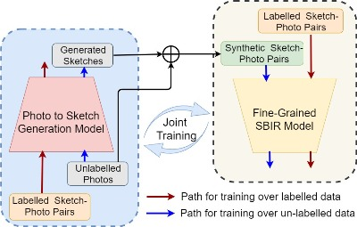
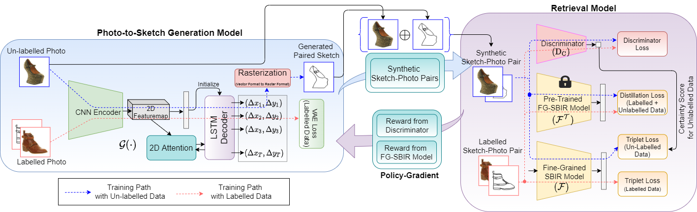
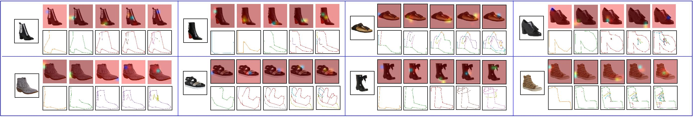

# More Photos are All You Need: Semi-Supervised Learning for Fine-Grained Sketch Based Image Retrieval, CVPR 2021.
**Ayan Kumar Bhunia**, Pinaki nath Chowdhury, Aneeshan Sain, Yongxin Yang, Tao Xiang, Yi-Zhe Song, “More Photos are All You Need: Semi-Supervised Learning for Fine-Grained Sketch Based Image Retrieval”, IEEE Conf. on Computer Vision and Pattern Recognition (**CVPR**), 2021.


## Abstract
A fundamental challenge faced by existing Fine-Grained Sketch-Based Image Retrieval (FG-SBIR) models is the data scarcity -- model performances are largely bottlenecked by the lack of sketch-photo pairs. Whilst the number of photos can be easily scaled, each corresponding sketch still needs to be individually produced. In this paper, we aim to mitigate such an upper-bound on sketch data, and study whether unlabelled photos alone (of which they are many) can be cultivated for performances gain. In particular, we introduce a novel semi-supervised framework for cross-modal retrieval that can additionally leverage large-scale unlabelled photos to account for data scarcity. At the centre of our semi-supervision design is a sequential photo-to-sketch generation model that aims to generate paired sketches for unlabelled photos. Importantly, we further introduce a discriminator guided mechanism to guide against unfaithful generation, together with a distillation loss based regularizer to provide tolerance against noisy training samples. Last but not least, we treat generation and retrieval as two conjugate problems, where a joint learning procedure is devised for each module to mutually benefit from each other. Extensive experiments show that our semi-supervised model yields significant performance boost over the state-of-the-art supervised alternatives, as well as existing methods that can exploit unlabelled photos for FG-SBIR.  

## Outline


**Figure:** Our proposed method additionally leverages large scale photos without any manually labelled paired sketches to improve FG-SBIR performance. Moreover, we show that the two conjugate process, photo-to-sketch generation and fine-grained SBIR, could improve each other by joint training.

## Joint Architecture


**Figure:** Our framework: a FG-SBIR model leverages large scale unlabelled photos using a sequential photo-to-sketch generation model along with labelled pairs. Discriminator guided instance-wise weighting and distillation loss are used to guard against the noisy generated data. Simultaneously, photo-to-sketch generation model learns by taking reward from FG-SBIR model and Discriminator via policy gradient (over both labelled and unlabelled) together with supervised VAE loss over labelled data. Note rasterization (vector to raster format) is a non-differentiable operation.


## Examples 

**Figure:** Qualitative results on our photo-to-sketch generation process, where sketch is shown with attention-map at progressive instances.


## Citation

If you find this article useful in your research, please consider citing:
```
@InProceedings{semi-fgsbir,
author = {Ayan Kumar Bhunia and Pinaki Nath Chowdhury and Aneeshan Sain and Yongxin Yang and Tao Xiang and Yi-Zhe Song},
title = {More Photos are All You Need: Semi-Supervised Learning for Fine-Grained Sketch Based Image Retrieval},
booktitle = {The IEEE Conference on Computer Vision and Pattern Recognition (CVPR)},
month = {June},
year = {2021}
}
```
## Work done at SketchX Lab, CVSSP, University of Surrey. 
